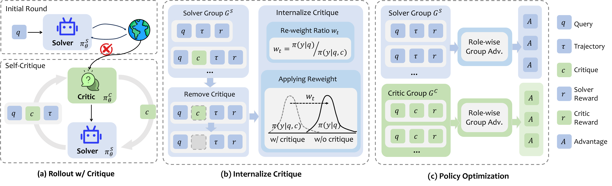

# ICRL: Learning to Internalize Self-Critique with Reinforcement Learning

This repository will host the official implementation of **ICRL**, a reinforcement learning framework for helping language agents internalize self-critique. 📄 [Paper](https://arxiv.org/pdf/2605.15224)

ICRL targets a common limitation of critique-based agent improvement: a model may solve a task after receiving critique, but fail again when the critique is removed. The goal of ICRL is to transfer critique-guided improvements back into the critique-free solver, so the agent improves its underlying capability instead of becoming dependent on external feedback.

<p align="center">
  
</p>

## Overview

ICRL jointly trains a solver and a critic from a shared backbone:

- The **critic** learns to produce feedback that improves the solver's subsequent attempt.
- The **solver** learns to internalize successful critique-guided revisions into its critique-free behavior.
- A distribution-calibration re-weighting ratio helps avoid blindly imitating behavior that only works under critique-conditioned prompts.

The method is evaluated on agentic and reasoning tasks, including text-world interaction, web navigation, multi-hop question answering, and mathematical reasoning.

## Quick Starts
### Preparation

ICRL relies on [AgentGym](https://github.com/WooooDyy/AgentGym) for training environments. To set up the ALFWorld environment, run the following commands:

1. Clone the repository
```bash
git clone https://github.com/WooooDyy/AgentGym.git
cd AgentGym/agentenv-alfworld
```

2. Create a conda environment for the target environment and install the dependencies.
```bash
conda create --name agentenv-alfworld python=3.9
conda activate agentenv-alfworld
bash ./setup.sh
```

3. Launch the environment server(s):
To start a single environment server, run:
```bash
alfworld --host 0.0.0.0 --port 36001
```

For parallel rollout, launch multiple environment servers on consecutive ports. The default ICRL configuration uses `custom.custom_config.env_port_base=36001` and `custom.custom_config.env_nums=32`, so it expects 32 environment servers on ports `36001` through `36032`. From the AgentGym root directory, run:

```bash
mkdir -p env_logs
for port in $(seq 36001 36032); do
    nohup alfworld --host 0.0.0.0 --port "${port}" > "env_logs/alfworld_${port}.log" 2>&1 &
done
```

The number of launched environment servers should match `custom.custom_config.env_nums`. If you launch `N` servers, use ports from `env_port_base` to `env_port_base + N - 1`, and set `custom.custom_config.env_nums=N` in the training command.


### Training
1. Start the target environment server(s) as described above.

2. Start training with the following command:
```
cd ICRL
python -m icrl.hydra_runner \
    custom=icrl \
    custom.env_name=alfworld \
    custom.custom_config.env_nums=32 \
    custom.custom_config.max_rounds=2 \
    +rollout.cli.start_rollout_id=0 \
    checkpoint=qwen3_8b \
    model=qwen3_8b \
    optimizer=adam_offload \
    algo.cli.use_tis=true \
    algo.cli.use_rollout_logprobs=false
```

## Citation

TBD
